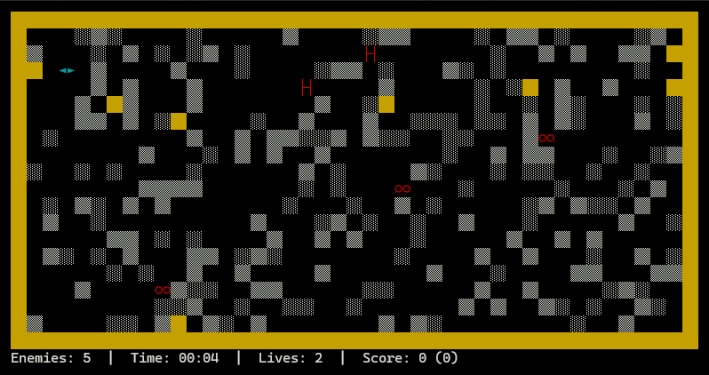

Gebaseerd op **Beast**, dat ooit in een ver verleden bij een versie van WordPerfect Office zat. Ik probeer het zo goed mogelijk te reconstrueren zoals ik het mij herinner, maar ik ga er denk ik ook wat aanpassingen aan doen. 

Wat ik mij herinner: 
- Beesten proberen speler op te vreten
- Er is een speelveld met verduwbare blokken en hier en daar een muur, en muren rondom 
- Vanaf een bepaald level waren er eieren die superbeesten werden
- Vanaf een bepaald level waren er een andere soort superbeesten
- Superbeest type 1 was alleen tegen een muur plat te duwen
- Superbeest type 2 probeerde de speler plat te duwen

Wat mij herinner maar niet ga houden:
- Speler moest een level kiezen, van A tot Z
- Elke level had een bepaalde moeilijkheid (bv. al dan niet superbeesten)
- Elke level had een aantal sublevels, en dat was dan dat
- Dus van level A tot Z spelen ging niet, het was altijd A1 tot A3, of K1 tot K6, etc. 

Wat ik wil veranderen:
- Vlotter verloop van levels
- Meer soorten beesten:
  - Hunter: standaardvijand, probeert held op te vreten
  - Crusher: probeert held plat te duwen
  - Sentinel: trager dan een Hunter, maar kan alleen platgeduwd worden tegen een muur
  - Breeder: als een Hunter lang genoeg leeft, kan die een Breeder worden, die eieren kan leggen
  - Eieren kunnen uit Breeders komen, maar ook zomaar op het speelveld liggen. Uit een ei komen Sentinels (of mogelijk ook andere beesten)